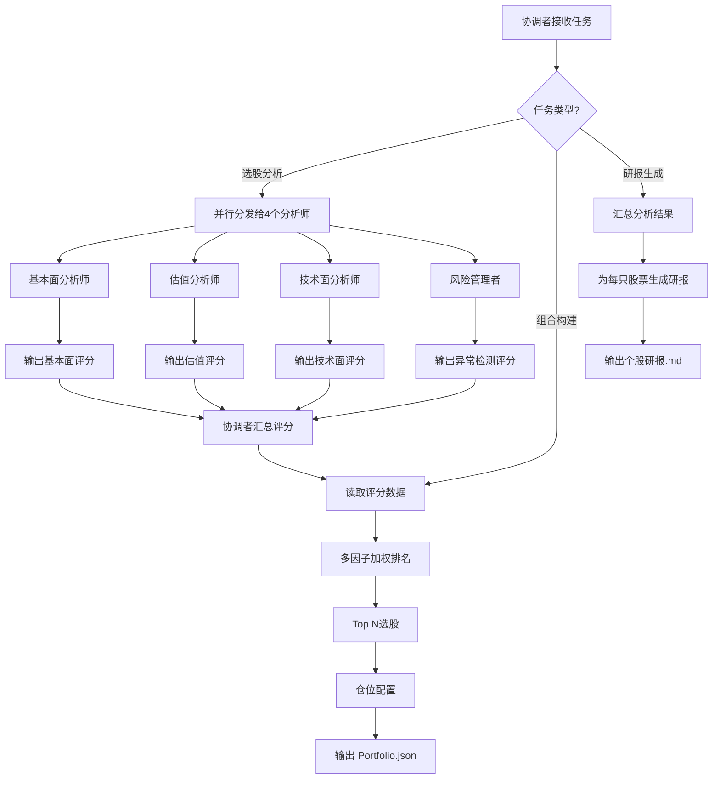

# 协作流程

## 流程图



## 执行步骤

### Phase 1: 并行分析（4个分析师同时执行）

协调者将股票列表分发给4个专业分析师：

1. **基本面分析师** → 调用 `stock-fundamental-analysis` Skill
   - 输入: ts_code 列表
   - 输出: 每只股票的基本面评分

2. **估值分析师** → 调用 `stock-valuation-analysis` Skill
   - 输入: ts_code 列表
   - 输出: 每只股票的估值评分

3. **技术面分析师** → 调用 `stock-technical-analysis` Skill
   - 输入: ts_code 列表
   - 输出: 每只股票的技术面评分

4. **风险管理者** → 调用 `financial-anomaly-detection` Skill
   - 输入: ts_code 列表
   - 输出: 每只股票的异常检测评分

### Phase 2: 结果汇总

协调者收集所有评分，计算综合加权得分：

```
综合评分 = 基本面×30% + 估值×25% + 技术面×20% + 异常检测×10%
```

### Phase 3: 组合构建

协调者调用 `portfolio-construction` Skill：
- 按综合评分排序
- 选取 Top N 股票
- 按评分加权配置仓位
- 输出 Portfolio.json

### Phase 4: 研报生成

协调者调用 `investment-report-generation` Skill：
- 为每只入选股票生成研报
- 综合各维度分析结果
- 输出 .md 格式研报文件
