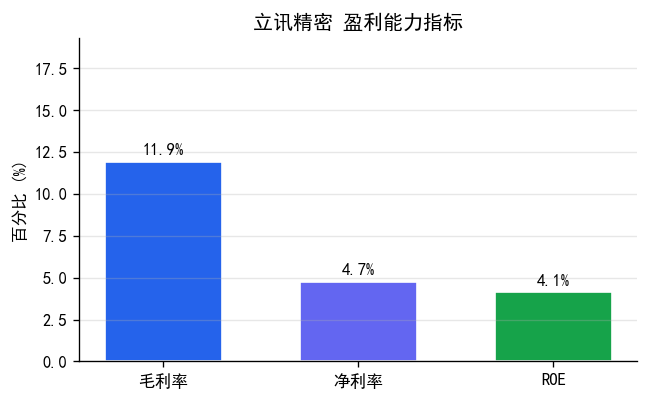
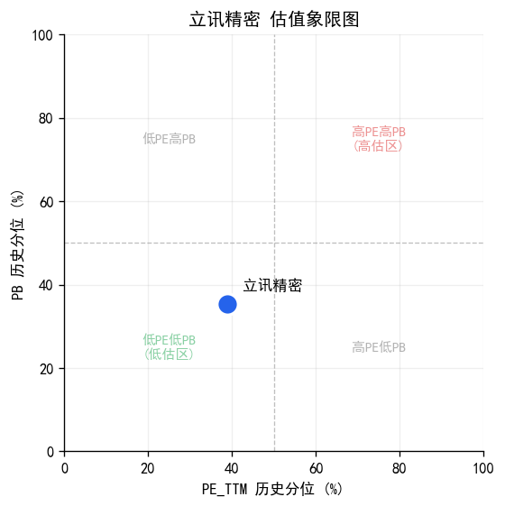
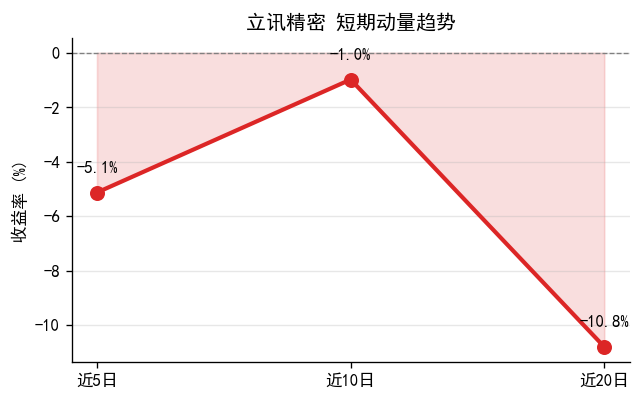
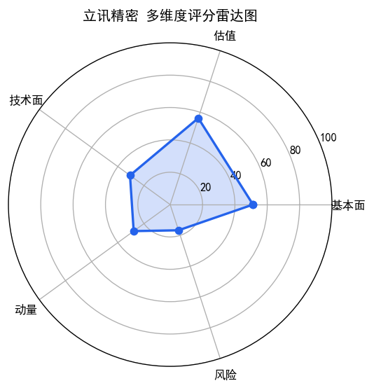

# 立讯精密(002475) 投资研究报告

## 一、投资要点

**综合评级: 中**

**核心优势:** 营收同比增长+35.77%，成长动能充足；净利润同比增长+17.49%，盈利增速领先

**主要风险:** 毛利率偏低，盈利能力较弱；现金流质量较差，利润缺乏现金支撑；应收账款占比+51.91%，回款风险较高；短期动量偏弱，近5日涨幅-5.13%；检测到HIGH级财务异常；20日波动率57.7%（年化），价格波动较大

## 二、公司概况

| 项目 | 内容 |
|------|------|
| 股票代码 | 002475 |
| 股票名称 | 立讯精密 |
| 所属板块 | 科技/AI/半导体板块 |
| 综合评级 | **中** |
| 全局排名 | 第43名（49只内） |
| 板块内排名 | 第8名（科技/AI/半导体板块内） |

### 各维度排名对比

| 维度 | 全局排名 | 板块排名 |
|------|----------|----------|
| 基本面 | 24 | 7 |
| 估值 | 22 | 8 |
| 技术面 | 34 | 7 |
| 动量 | 36 | 4 |
| 风险 | 41 | 12 |

## 三、盈利能力分析

| 指标 | 数值 | 评级 | 说明 |
|------|------|------|------|
| 毛利率 | +11.92% | 差 | 越高越好，反映产品竞争力 |
| 净利率 | +4.73% | 差 | 综合盈利能力 |
| ROE | +4.12% | 差 | 股东回报率 |



> **图表解读**: 毛利率+11.92%，偏低，可能面临成本上升或价格竞争压力；毛利率与净利率差距仅7.2个百分点，费用控制能力优秀；ROE仅+4.12%，股东回报偏低，需关注资本使用效率

> 数据来源: market_data.stock_financial（财务报表明细数据）

## 四、盈利真实性与营运风险

| 指标 | 数值 | 评级 | 说明 |
|------|------|------|------|
| 经营现金流/净利润 | -1.78 | 差 | >1说明利润有现金支撑 |
| 应收账款/营收 | +51.91% | 差 | 越低越好，回款风险小 |
| 资产负债率 | +66.53% | 中 | 越低越安全 |

> 数据来源: market_data.stock_financial（现金流量表、资产负债表）

## 五、成长性分析

| 指标 | 数值 | 评级 |
|------|------|------|
| 营收同比增长率 | +35.77% | 优 |
| 净利润同比增长率 | +17.49% | 良 |
| 营收环比增长率 | -24.72% | -- |
| 净利润环比增长率 | -27.09% | -- |

> 数据来源: market_data.stock_financial（利润表同比/环比计算）

## 六、估值分析

| 指标 | 当前值 | 历史分位 | 估值评级 |
|------|--------|----------|----------|
| PE_TTM | 25.79 | +38.85% | 合理 |
| PB | 5.03 | +35.25% | 合理 |



> **图表解读**: PE_TTM历史分位+38.85%，处于合理偏低水平

> 数据来源: market_data.stock_kline（近1年K线数据计算历史分位数）

## 七、技术面分析

| 指标 | 数值 | 评级 |
|------|------|------|
| 最新收盘价 | 57.48 | -- |
| MA趋势 | 交叉盘整 | 中性 |
| MACD信号 | 金叉 | 偏多 |
| RSI6信号 | 中性 | -- |
| KDJ信号 | 死叉 | -- |

> 数据来源: market_data.stock_kline（近120个交易日K线数据计算技术指标）

## 八、动量与趋势分析

| 指标 | 数值 | 评级 |
|------|------|------|
| 近5日收益率 | -5.13% | 弱势 |
| 近10日收益率 | -0.98% | -- |
| 近20日收益率 | -10.80% | -- |
| 量比(5/20) | 1.05 | 温和放量 |
| 20日波动率(年化) | +57.71% | -- |



> **图表解读**: 近5/10/20日收益率均为负，短期趋势偏弱，建议观望；量比1.05，成交温和放量

> 数据来源: market_data.stock_kline（近20个交易日收益率和成交量数据）

## 九、风险检测

```
=== 立讯精密(002475.SZ) 财务异常检测 ===
报告期: 20260331

检测结果: 4个异常信号 (高风险: 3个, 中风险: 1个)

!! [HIGH] 经营现金流为负
   数据: 净利润: 39.68亿, 经营现金流: -70.68亿
   说明: 盈利但经营现金流为负，可能应收账款激增或存货积压

!! [HIGH] 经营现金流骤降
   数据: 上期: 173.25亿 → 本期: -70.68亿 (变化: -140.80%)
   说明: 经营现金流同比大幅下降，需关注经营质量

!! [HIGH] 净利润与现金流持续背离
   数据: 最近4期中有2期净利润为正但经营现金流为负
   说明: 连续多期盈利但经营现金流为负，盈利质量存疑

!  [MEDIUM] 应收账款占比过高
   数据: 应收账款/营业收入: 51.9%
   说明: 应收账款占营收比例过高，收入质量存疑

```

> 数据来源: market_data.stock_financial（7类财务异常规则检测）

## 十、综合评估

综合评级: **中**



> **图表解读**: 短板维度: 动量全局排名靠后（第36名，板块内第4名）、风险全局排名靠后（第41名，板块内第12名）；全局排名43.0（第43名），科技/AI/半导体板块内排名第8名

> 评级基于盈利能力、估值水平、技术面趋势、动量强度等多维度定性判断。

## 十一、行业对比（科技/AI/半导体板块）

### 财务指标对比

| 指标 | 本公司 | 行业均值 | 对比 |
|------|--------|----------|------|
| 毛利率 | +11.92% | +36.50% | 低于 |
| ROE | +4.12% | +4.68% | 低于 |
| 营收增长率 | +35.77% | -- | -- |

### 估值对比

| 指标 | 本公司 | 行业均值 | 对比 |
|------|--------|----------|------|
| PE_TTM | 25.79 | 87.57 | 低于行业 |
| PB | 5.03 | 11.95 | 低于行业 |

### 板块行情表现

| 指标 | 板块数据 | 说明 |
|------|----------|------|
| 板块近5日涨跌幅 | -9.30% | 板块整体短期动量 |
| 板块近20日涨跌幅 | -18.14% | 板块整体中期趋势 |

> 数据来源: market_data.sector_industry_daily / sector_industry_cons（行业板块行情与成分股数据）

## 十二、盈利预测

| 预测项 | 预测值 | 预测依据 |
|--------|--------|----------|
| 营收增速 | 预计下一年营收增速约 25.0%（基于本期35.8%的70%衰减） | 基于本期增速70%衰减 |
| 净利润增速 | 预计下一年净利润增速约 12.2%（基于本期17.5%的70%衰减） | 基于本期增速70%衰减 |
| 远期PE | 按预测增速，远期PE约 23.0（当前25.8） | 按预测增速折算 |

> 注：预测基于历史增长率简单外推（衰减系数0.7），仅供参考，不构成盈利承诺。

---

> 风险提示: 本报告基于量化模型自动生成，仅供参考，不构成投资建议。投资有风险，入市需谨慎。

---

## 附录：评级标准

| 维度 | 优 | 良 | 中 | 差 |
|------|------|------|------|------|
| 毛利率 | >40% | 25-40% | 15-25% | <15% |
| 净利率 | >20% | 12-20% | 6-12% | <6% |
| ROE | >18% | 12-18% | 6-12% | <6% |
| 经营现金流/净利润 | >1.2 | 0.8-1.2 | 0.5-0.8 | <0.5 |
| 应收账款/营收 | <10% | 10-20% | 20-30% | >30% |
| 资产负债率 | <30% | 30-50% | 50-70% | >70% |

| 维度 | 低估/偏多/强势 | 合理/中性/偏强 | 偏高/偏弱 | 高估/弱势 |
|------|----------------|----------------|-----------|-----------|
| PE/PB历史分位 | <20% | 20-50% | 50-80% | >80% |
| MA趋势 | 多头排列 | 交叉盘整 | -- | 空头排列 |
| 近5日收益率 | >5% | 1-5% | -5~1% | <-5% |
| 量比 | >1.5 | 1.0-1.5 | 0.7-1.0 | <0.7 |
