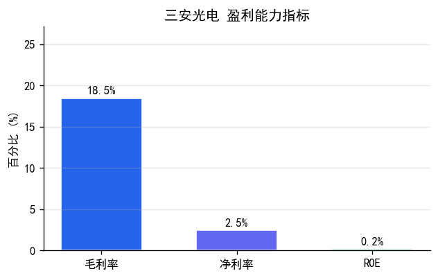
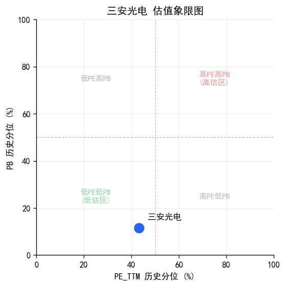
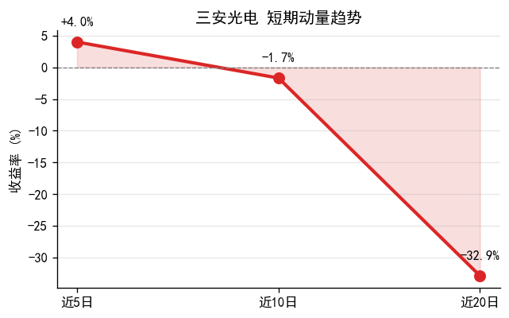
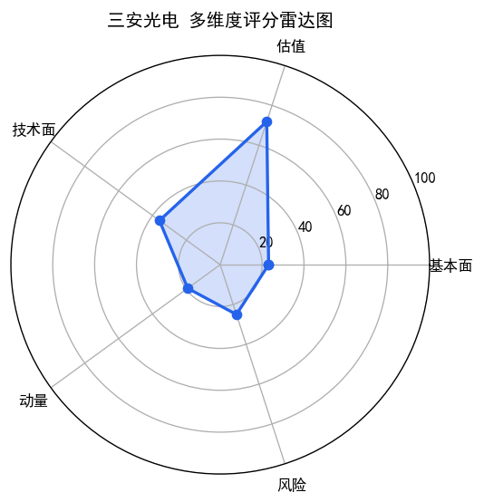

# 三安光电(600703) 投资研究报告

## 一、投资要点

**综合评级: 中**

**核心优势:** 经营现金流/净利润4.99，盈利质量扎实；短期动量偏强，近5日涨幅+3.99%

**主要风险:** 应收账款占比+124.38%，回款风险较高；营收同比下滑，成长动能不足；净利润同比下滑，盈利能力承压；检测到HIGH级财务异常；20日波动率73.4%（年化），价格波动较大

## 二、公司概况

| 项目 | 内容 |
|------|------|
| 股票代码 | 600703 |
| 股票名称 | 三安光电 |
| 所属板块 | 科技/AI/半导体板块 |
| 综合评级 | **中** |
| 全局排名 | 第47名（49只内） |
| 板块内排名 | 第10名（科技/AI/半导体板块内） |

### 各维度排名对比

| 维度 | 全局排名 | 板块排名 |
|------|----------|----------|
| 基本面 | 38 | 10 |
| 估值 | 14 | 6 |
| 技术面 | 32 | 6 |
| 动量 | 40 | 7 |
| 风险 | 37 | 8 |

## 三、盈利能力分析

| 指标 | 数值 | 评级 | 说明 |
|------|------|------|------|
| 毛利率 | +18.48% | 中 | 越高越好，反映产品竞争力 |
| 净利率 | +2.48% | 差 | 综合盈利能力 |
| ROE | +0.19% | 差 | 股东回报率 |



> **图表解读**: 毛利率+18.48%，处于中等水平，盈利能力一般；ROE仅+0.19%，股东回报偏低，需关注资本使用效率

> 数据来源: market_data.stock_financial（财务报表明细数据）

## 四、盈利真实性与营运风险

| 指标 | 数值 | 评级 | 说明 |
|------|------|------|------|
| 经营现金流/净利润 | 4.99 | 优 | >1说明利润有现金支撑 |
| 应收账款/营收 | +124.38% | 差 | 越低越好，回款风险小 |
| 资产负债率 | +39.32% | 良 | 越低越安全 |

> 数据来源: market_data.stock_financial（现金流量表、资产负债表）

## 五、成长性分析

| 指标 | 数值 | 评级 |
|------|------|------|
| 营收同比增长率 | -32.59% | 差 |
| 净利润同比增长率 | -66.89% | 差 |
| 营收环比增长率 | -29.65% | -- |
| 净利润环比增长率 | +116.40% | -- |

> 数据来源: market_data.stock_financial（利润表同比/环比计算）

## 六、估值分析

| 指标 | 当前值 | 历史分位 | 估值评级 |
|------|--------|----------|----------|
| PE_TTM | -122.71 | +43.17% | 合理 |
| PB | 1.75 | +11.51% | 低估 |



> **图表解读**: PE_TTM历史分位+43.17%，处于合理偏低水平；PB历史分位+11.51%，市净率处于低位，资产价值被低估；PE_TTM为负值，公司当期亏损，传统估值方法不适用

> 数据来源: market_data.stock_kline（近1年K线数据计算历史分位数）

## 七、技术面分析

| 指标 | 数值 | 评级 |
|------|------|------|
| 最新收盘价 | 12.24 | -- |
| MA趋势 | 交叉盘整 | 中性 |
| MACD信号 | 死叉 | 偏空 |
| RSI6信号 | 中性 | -- |
| KDJ信号 | 金叉 | -- |

> 数据来源: market_data.stock_kline（近120个交易日K线数据计算技术指标）

## 八、动量与趋势分析

| 指标 | 数值 | 评级 |
|------|------|------|
| 近5日收益率 | +3.99% | 偏强 |
| 近10日收益率 | -1.69% | -- |
| 近20日收益率 | -32.86% | -- |
| 量比(5/20) | 0.7 | 温和缩量 |
| 20日波动率(年化) | +73.36% | -- |



> **图表解读**: 近5日涨幅+4.0%但近20日跌幅-32.9%，短期反弹但中期仍偏弱，需观察能否持续

> 数据来源: market_data.stock_kline（近20个交易日收益率和成交量数据）

## 九、风险检测

```
=== 三安光电(600703.SH) 财务异常检测 ===
报告期: 20260331

检测结果: 1个异常信号 (高风险: 1个)

!! [HIGH] 应收账款占比过高
   数据: 应收账款/营业收入: 124.4%
   说明: 应收账款占营收比例过高，收入质量存疑

```

> 数据来源: market_data.stock_financial（7类财务异常规则检测）

## 十、综合评估

综合评级: **中**



> **图表解读**: 优势维度: 估值全局排名靠前（第14名，板块内第6名）；短板维度: 基本面全局排名靠后（第38名，板块内第10名）、动量全局排名靠后（第40名，板块内第7名）、风险全局排名靠后（第37名，板块内第8名）；全局排名47.0（第47名），科技/AI/半导体板块内排名第10名

> 评级基于盈利能力、估值水平、技术面趋势、动量强度等多维度定性判断。

## 十一、行业对比（科技/AI/半导体板块）

### 财务指标对比

| 指标 | 本公司 | 行业均值 | 对比 |
|------|--------|----------|------|
| 毛利率 | +18.48% | +36.50% | 低于 |
| ROE | +0.19% | +4.68% | 低于 |
| 营收增长率 | -32.59% | -- | -- |

### 估值对比

| 指标 | 本公司 | 行业均值 | 对比 |
|------|--------|----------|------|
| PE_TTM | -122.71 | 87.57 | 低于行业 |
| PB | 1.75 | 11.95 | 低于行业 |

### 板块行情表现

| 指标 | 板块数据 | 说明 |
|------|----------|------|
| 板块近5日涨跌幅 | -9.30% | 板块整体短期动量 |
| 板块近20日涨跌幅 | -18.14% | 板块整体中期趋势 |

> 数据来源: market_data.sector_industry_daily / sector_industry_cons（行业板块行情与成分股数据）

## 十二、盈利预测

| 预测项 | 预测值 | 预测依据 |
|--------|--------|----------|
| 营收增速 | 预计下一年营收增速约 -22.8%（基于本期-32.6%的70%衰减） | 基于本期增速70%衰减 |
| 净利润增速 | 预计下一年净利润增速约 -46.8%（基于本期-66.9%的70%衰减） | 基于本期增速70%衰减 |
| 远期PE | 按预测增速，远期PE约 -230.7（当前-122.7） | 按预测增速折算 |

> 注：预测基于历史增长率简单外推（衰减系数0.7），仅供参考，不构成盈利承诺。

---

> 风险提示: 本报告基于量化模型自动生成，仅供参考，不构成投资建议。投资有风险，入市需谨慎。

---

## 附录：评级标准

| 维度 | 优 | 良 | 中 | 差 |
|------|------|------|------|------|
| 毛利率 | >40% | 25-40% | 15-25% | <15% |
| 净利率 | >20% | 12-20% | 6-12% | <6% |
| ROE | >18% | 12-18% | 6-12% | <6% |
| 经营现金流/净利润 | >1.2 | 0.8-1.2 | 0.5-0.8 | <0.5 |
| 应收账款/营收 | <10% | 10-20% | 20-30% | >30% |
| 资产负债率 | <30% | 30-50% | 50-70% | >70% |

| 维度 | 低估/偏多/强势 | 合理/中性/偏强 | 偏高/偏弱 | 高估/弱势 |
|------|----------------|----------------|-----------|-----------|
| PE/PB历史分位 | <20% | 20-50% | 50-80% | >80% |
| MA趋势 | 多头排列 | 交叉盘整 | -- | 空头排列 |
| 近5日收益率 | >5% | 1-5% | -5~1% | <-5% |
| 量比 | >1.5 | 1.0-1.5 | 0.7-1.0 | <0.7 |
