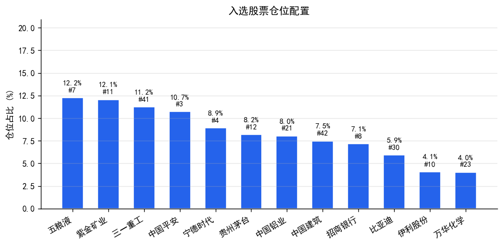
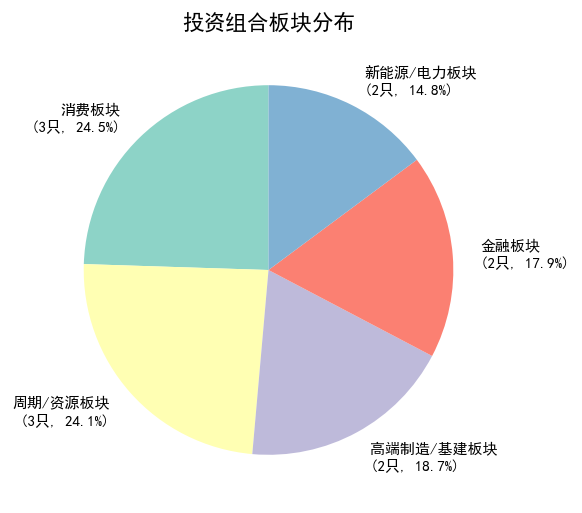

# 量化投资报告

## 一、选股逻辑

### 1.1 分析框架

本 Agent 采用**多因子量化选股模型**，对比赛指定的 49 只 A 股进行绝对排名（1-49，1=最优），Agent 根据排名数据自主决策持仓和权重。

**分析维度与核心指标：**

| 维度 | 权重 | 核心指标 |
|------|------|----------|
| 基本面 | 20% | ROE、毛利率/营业利润率、净利率、杜邦三因子（净利率/周转率/权益乘数）、经营现金流/净利润、应收账款占比、营收/净利润同比增长率 |
| 估值 | 15% | PE_TTM 历史分位数、PB 历史分位数（近1年） |
| 技术面 | 30% | MA 趋势、MACD 信号、RSI 超买超卖、KDJ 交叉信号 |
| 动量 | 25% | 近5/10/20日收益率、量比（5日/20日均量）、20日波动率 |
| 风险 | 10% | 7类财务异常检测（现金流骤降、应收账款激增、商誉减值等） |

### 1.2 排名规则

各指标在 49 只股票内计算绝对排名（1=最优，49=最差）。综合排名 = 各维度平均排名 × 维度权重的加权平均。同时计算**板块内排名**（同板块内比较），更准确反映个股在行业内的相对位置。

### 1.3 选股流程

```
49只股票 → 各维度原始数据采集 → 49只内绝对排名 → Agent 自主分析决策
```

## 二、仓位决策依据

Agent 综合考虑基本面排名、估值水平、技术面趋势和风险检测结果，自主决策持仓和权重。

- 单只股票最大仓位不超过 20%（约束条件）
- 权重归一化确保总和 = 1.0
- 入选 12 只股票，覆盖 5 个板块

## 三、分析过程

### 3.1 基本面分析

按分析框架顺序对 49 只股票逐一计算：

| 步骤 | 分析内容 | 核心指标 |
|------|----------|----------|
| 1 | 盈利能力 | 毛利率/营业利润率、净利率 |
| 2 | 股东回报 | ROE + 杜邦拆解（净利率 × 周转率 × 权益乘数） |
| 3 | 现金流质量 | 经营现金流/净利润、应收账款占比 |
| 4 | 成长性 | 营收/净利润同比、环比增长率 |
| 5 | 估值 | PE_TTM、PB 历史分位数 |

### 3.2 估值分析

基于近 1 年 K 线数据计算 PE_TTM 和 PB 的历史分位数：

- **低估信号**：分位数 < 20%，估值有较大提升空间
- **合理区间**：分位数 20%-50%
- **偏高信号**：分位数 50%-80%
- **高估信号**：分位数 > 80%

### 3.3 技术面分析

基于近 120 个交易日 K 线数据计算技术指标（权重30%）：

- **MA 趋势**：5/10/20/60 日均线排列判断多空
- **MACD**：DIF/DEA 交叉判断买卖信号
- **RSI**：6/12/24 日 RSI 判断超买超卖
- **KDJ**：K/D/J 交叉判断短期趋势

### 3.4 动量分析

基于近 20 个交易日数据计算动量因子（权重25%）：

- **短期动量**：近5日收益率，捕捉近期强势股
- **中期动量**：近10/20日收益率，确认趋势持续性
- **量比**：5日均量/20日均量，>1表示资金流入加速
- **波动率**：20日日收益率标准差（年化），越低越稳定

### 3.5 异常检测

执行 7 类财务异常检测：

1. **经营现金流骤降**：净利润增长但现金流大幅下降
2. **应收账款激增**：应收账款增速远超营收增速
3. **商誉减值风险**：商誉占净资产比例 > 15%
4. **存货异常增长**：存货增速远超营收增速
5. **负债率飙升**：资产负债率短期大幅上升
6. **利润-现金流背离**：连续多期盈利但现金流为负
7. **毛利率/营业利润率异常波动**：毛利率或营业利润率大幅下降 > 10 个百分点

> 数据来源: market_data.stock_financial（财务报表历史数据对比）、market_data.stock_kline（K线行情数据）

## 四、风险评估

### 4.1 组合风险特征

| 风险维度 | 评估结果 |
|----------|----------|
| 行业集中度 | 消费板块占比24.5%，分布较为均衡 |
| 个股集中度 | 前3只股票占比35.5%，集中度适中 |
| 估值风险 | 入选股票 PE_TTM 分位数均处于合理区间 |
| 财务风险 | 入选股票均未检测到 HIGH 级财务异常 |
| 流动性风险 | 入选股票均为大盘蓝筹，流动性充足 |

### 4.2 主要风险点

1. **行业集中风险**：消费板块板块权重较高（3只，占24.5%），若该板块回调，组合可能面临较大回撤
2. **满仓风险**：现金比例为 0%，无缓冲空间
3. **单一因子偏差**：历史数据驱动的量化模型可能忽略突发事件影响

### 4.3 风险缓释措施

- 行业均衡机制限制单一行业过度集中
- 异常检测模块自动过滤财务风险较高的标的
- 单只股票 20% 仓位上限控制个股风险

## 五、止损策略

| 触发条件 | 操作 | 说明 |
|----------|------|------|
| 单只股票回撤 > 8% | 减半仓 | 个股止损，控制单票亏损 |
| 组合整体回撤 > 5% | 降低仓位至 70% | 组合止损，保留30%现金缓冲 |
| 触发止损后 | 保留 30% 现金 | 为反弹预留资金 |

## 六、最终投资组合

### 6.1 组合明细

| 序号 | 代码 | 名称 | 板块 | 全局排名 | 板块排名 | 仓位 |
|------|------|------|------|----------|----------|------|
| 1 | 000858 | 五粮液 | 消费板块 | 7 | 1 | 12.24% |
| 2 | 601899 | 紫金矿业 | 周期/资源板块 | 11 | 1 | 12.06% |
| 3 | 600031 | 三一重工 | 高端制造/基建板块 | 41 | 1 | 11.22% |
| 4 | 601318 | 中国平安 | 金融板块 | 3 | 1 | 10.72% |
| 5 | 300750 | 宁德时代 | 新能源/电力板块 | 4 | 1 | 8.90% |
| 6 | 600519 | 贵州茅台 | 消费板块 | 12 | 2 | 8.17% |
| 7 | 601600 | 中国铝业 | 周期/资源板块 | 21 | 2 | 8.03% |
| 8 | 601668 | 中国建筑 | 高端制造/基建板块 | 42 | 2 | 7.48% |
| 9 | 600036 | 招商银行 | 金融板块 | 8 | 2 | 7.15% |
| 10 | 002594 | 比亚迪 | 新能源/电力板块 | 30 | 2 | 5.93% |
| 11 | 600887 | 伊利股份 | 消费板块 | 10 | 3 | 4.08% |
| 12 | 600309 | 万华化学 | 周期/资源板块 | 23 | 3 | 4.02% |
| **合计** | | | | | | **100.00%** |



> 数据来源: Agent 综合多维度排名自主决策

### 6.2 入选股票核心指标


**1. 五粮液(000858) — 仓位 12.24%**
- 全局排名: 第7名 | 板块内排名: 第1名（消费板块）
- **入选理由**: 全局排名第7名，综合表现优秀；消费板块内排名第1名，板块龙头；优势维度: 技术面；短期动量偏强(+6.0%)
- 基本面: ROE排名10，毛利率排名2，净利率排名10
- 估值: PE排名39，PB排名14
- 动量: 5日涨幅+6.0%，排名8，20日排名29

**2. 紫金矿业(601899) — 仓位 12.06%**
- 全局排名: 第11名 | 板块内排名: 第1名（周期/资源板块）
- **入选理由**: 全局排名第11名，综合表现良好；周期/资源板块内排名第1名，板块龙头；优势维度: 基本面；短期动量偏强(+4.6%)
- 基本面: ROE排名4，毛利率排名13，净利率排名16
- 估值: PE排名20，PB排名25
- 动量: 5日涨幅+4.6%，排名15，20日排名2

**3. 三一重工(600031) — 仓位 11.22%**
- 全局排名: 第41名 | 板块内排名: 第1名（高端制造/基建板块）
- **入选理由**: 全局排名第41名；高端制造/基建板块内排名第1名，板块龙头；短期动量偏强(+5.0%)
- 基本面: ROE排名28，毛利率排名20，净利率排名32
- 估值: PE排名27，PB排名33
- 动量: 5日涨幅+5.0%，排名12，20日排名18

**4. 中国平安(601318) — 仓位 10.72%**
- 全局排名: 第3名 | 板块内排名: 第1名（金融板块）
- **入选理由**: 全局排名第3名，综合表现优秀；金融板块内排名第1名，板块龙头；优势维度: 技术面
- 基本面: ROE排名None，毛利率排名7，净利率排名25
- 估值: PE排名19，PB排名24
- 动量: 5日涨幅+1.6%，排名28，20日排名16

**5. 宁德时代(300750) — 仓位 8.90%**
- 全局排名: 第4名 | 板块内排名: 第1名（新能源/电力板块）
- **入选理由**: 全局排名第4名，综合表现优秀；新能源/电力板块内排名第1名，板块龙头；优势维度: 估值；短期动量偏强(+3.2%)
- 基本面: ROE排名12，毛利率排名24，净利率排名20
- 估值: PE排名2，PB排名2
- 动量: 5日涨幅+3.2%，排名24，20日排名32

**6. 贵州茅台(600519) — 仓位 8.17%**
- 全局排名: 第12名 | 板块内排名: 第2名（消费板块）
- **入选理由**: 全局排名第12名，综合表现良好；消费板块内排名第2名，板块龙头；短期动量偏强(+4.1%)；毛利率优秀(89.9%)
- 基本面: ROE排名3，毛利率排名1，净利率排名1
- 估值: PE排名40，PB排名27
- 动量: 5日涨幅+4.1%，排名19，20日排名10

**7. 中国铝业(601600) — 仓位 8.03%**
- 全局排名: 第21名 | 板块内排名: 第2名（周期/资源板块）
- **入选理由**: 全局排名第21名；周期/资源板块内排名第2名，板块龙头；优势维度: 估值；估值处于低位
- 基本面: ROE排名8，毛利率排名23，净利率排名21
- 估值: PE排名8，PB排名13
- 动量: 5日涨幅+1.4%，排名29，20日排名7

**8. 中国建筑(601668) — 仓位 7.48%**
- 全局排名: 第42名 | 板块内排名: 第2名（高端制造/基建板块）
- **入选理由**: 全局排名第42名；高端制造/基建板块内排名第2名，板块龙头
- 基本面: ROE排名27，毛利率排名38，净利率排名41
- 估值: PE排名34，PB排名7
- 动量: 5日涨幅+0.0%，排名36，20日排名30

**9. 招商银行(600036) — 仓位 7.15%**
- 全局排名: 第8名 | 板块内排名: 第2名（金融板块）
- **入选理由**: 全局排名第8名，综合表现优秀；金融板块内排名第2名，板块龙头；优势维度: 技术面；营业利润率优秀(51.4%)
- 基本面: ROE排名25，毛利率排名1，净利率排名3
- 估值: PE排名37，PB排名31
- 动量: 5日涨幅+1.1%，排名31，20日排名19

**10. 比亚迪(002594) — 仓位 5.93%**
- 全局排名: 第30名 | 板块内排名: 第2名（新能源/电力板块）
- **入选理由**: 全局排名第30名；新能源/电力板块内排名第2名，板块龙头；短期动量偏强(+4.2%)
- 基本面: ROE排名38，毛利率排名32，净利率排名44
- 估值: PE排名44，PB排名29
- 动量: 5日涨幅+4.2%，排名17，20日排名25

**11. 伊利股份(600887) — 仓位 4.08%**
- 全局排名: 第10名 | 板块内排名: 第3名（消费板块）
- **入选理由**: 全局排名第10名，综合表现优秀
- 基本面: ROE排名5，毛利率排名11，净利率排名24
- 估值: PE排名16，PB排名28
- 动量: 5日涨幅+0.2%，排名35，20日排名21

**12. 万华化学(600309) — 仓位 4.02%**
- 全局排名: 第23名 | 板块内排名: 第3名（周期/资源板块）
- **入选理由**: 全局排名第23名；估值处于低位
- 基本面: ROE排名21，毛利率排名35，净利率排名36
- 估值: PE排名15，PB排名19
- 动量: 5日涨幅+1.0%，排名32，20日排名27


### 6.3 板块分布

| 板块 | 股票数 | 合计仓位 |
|------|--------|----------|
| 消费板块 | 3 | 24.49% |
| 周期/资源板块 | 3 | 24.11% |
| 高端制造/基建板块 | 2 | 18.70% |
| 金融板块 | 2 | 17.87% |
| 新能源/电力板块 | 2 | 14.83% |
| **合计** | **12** | **100.00%** |



## 七、49只股票全量排名

> ★ 标记为入选投资组合的股票

| 板块 | 代码 | 名称 | 全局排名 | 板块排名 | 近5日涨幅 | 入选 | 理由 |
|------|------|------|----------|----------|-----------|------|------|
| 金融板块 | 601318 | 中国平安 | 3 | 1 | +1.6% | ★ | 全局排名第3名，综合表现优秀；金融板块内排名第1名，板块龙头；优势维度: 技术面 |
| 金融板块 | 600036 | 招商银行 | 8 | 2 | +1.1% | ★ | 全局排名第8名，综合表现优秀；金融板块内排名第2名，板块龙头；优势维度: 技术面；营业利润率优秀(51.4%) |
| 金融板块 | 601288 | 农业银行 | 5 | 3 | +3.6% |  | 检测到HIGH级财务异常；短板维度: 估值；估值偏高 |
| 金融板块 | 601688 | 华泰证券 | 20 | 4 | -3.8% |  | 检测到HIGH级财务异常；短期动量偏弱(-3.8%) |
| 金融板块 | 601398 | 工商银行 | 14 | 5 | +3.1% |  | 检测到HIGH级财务异常；短板维度: 估值；估值偏高 |
| 金融板块 | 600000 | 浦发银行 | 1 | 6 | +5.2% |  | 检测到HIGH级财务异常 |
| 金融板块 | 601988 | 中国银行 | 16 | 7 | +0.8% |  | 检测到HIGH级财务异常；短板维度: 估值；估值偏高 |
| 金融板块 | 601998 | 中信银行 | 15 | 8 | +2.8% |  | 检测到HIGH级财务异常；短板维度: 估值 |
| 消费板块 | 000858 | 五粮液 | 7 | 1 | +6.0% | ★ | 全局排名第7名，综合表现优秀；消费板块内排名第1名，板块龙头；优势维度: 技术面；短期动量偏强(+6.0%) |
| 消费板块 | 600519 | 贵州茅台 | 12 | 2 | +4.1% | ★ | 全局排名第12名，综合表现良好；消费板块内排名第2名，板块龙头；短期动量偏强(+4.1%)；毛利率优秀(89.9%) |
| 消费板块 | 600887 | 伊利股份 | 10 | 3 | +0.2% | ★ | 全局排名第10名，综合表现优秀 |
| 消费板块 | 600660 | 福耀玻璃 | 13 | 4 | +7.2% |  | 检测到MEDIUM级财务异常；短板维度: 估值；估值偏高 |
| 消费板块 | 603288 | 海天味业 | 9 | 5 | +7.2% |  | 检测到HIGH级财务异常 |
| 消费板块 | 600809 | 山西汾酒 | 2 | 6 | +5.5% |  | 全局排名第2名，表现良好但未入选（板块名额有限或竞争激烈） |
| 消费板块 | 601888 | 中国中免 | 6 | 7 | +9.0% |  | 检测到HIGH级财务异常 |
| 消费板块 | 000333 | 美的集团 | 18 | 8 | +3.7% |  | 短板维度: 估值；估值偏高 |
| 消费板块 | 000651 | 格力电器 | 22 | 9 | +4.5% |  | 短板维度: 估值；估值偏高 |
| 新能源/电力板块 | 300750 | 宁德时代 | 4 | 1 | +3.2% | ★ | 全局排名第4名，综合表现优秀；新能源/电力板块内排名第1名，板块龙头；优势维度: 估值；短期动量偏强(+3.2%) |
| 新能源/电力板块 | 002594 | 比亚迪 | 30 | 2 | +4.2% | ★ | 全局排名第30名；新能源/电力板块内排名第2名，板块龙头；短期动量偏强(+4.2%) |
| 新能源/电力板块 | 601012 | 隆基绿能 | 28 | 3 | +4.6% |  | 检测到HIGH级财务异常；短板维度: 基本面；估值偏高 |
| 新能源/电力板块 | 600900 | 长江电力 | 27 | 4 | +0.7% |  | 短板维度: 估值；估值偏高 |
| 新能源/电力板块 | 600438 | 通威股份 | 29 | 5 | +4.8% |  | 检测到HIGH级财务异常；短板维度: 基本面；估值偏高 |
| 新能源/电力板块 | 300274 | 阳光电源 | 31 | 6 | -8.9% |  | 检测到HIGH级财务异常；短板维度: 动量；短期动量偏弱(-8.9%) |
| 新能源/电力板块 | 600089 | 特变电工 | 19 | 7 | +2.7% |  | 检测到HIGH级财务异常 |
| 新能源/电力板块 | 600212 | 绿能慧充 | 33 | 8 | +5.9% |  | 检测到HIGH级财务异常 |
| 科技/AI/半导体板块 | 600570 | 恒生电子 | 17 | 1 | +10.3% |  | 检测到HIGH级财务异常 |
| 科技/AI/半导体板块 | 688981 | 中芯国际 | 40 | 2 | -13.7% |  | 短板维度: 估值/动量；短期动量偏弱(-13.7%) |
| 科技/AI/半导体板块 | 603501 | 韦尔股份 | 34 | 3 | -8.5% |  | 检测到MEDIUM级财务异常；短板维度: 动量；短期动量偏弱(-8.5%) |
| 科技/AI/半导体板块 | 300308 | 中际旭创 | 37 | 4 | -13.8% |  | 检测到MEDIUM级财务异常；短板维度: 技术面/动量；短期动量偏弱(-13.8%) |
| 科技/AI/半导体板块 | 300394 | 天孚通信 | 35 | 5 | -15.9% |  | 检测到HIGH级财务异常；短板维度: 动量；短期动量偏弱(-15.9%) |
| 科技/AI/半导体板块 | 603986 | 兆易创新 | 25 | 6 | -17.2% |  | 检测到MEDIUM级财务异常；短板维度: 动量；短期动量偏弱(-17.2%) |
| 科技/AI/半导体板块 | 600845 | 宝信软件 | 39 | 7 | +6.5% |  | 检测到HIGH级财务异常；短板维度: 技术面 |
| 科技/AI/半导体板块 | 002475 | 立讯精密 | 43 | 8 | -5.1% |  | 检测到HIGH级财务异常；短板维度: 动量；短期动量偏弱(-5.1%) |
| 科技/AI/半导体板块 | 600183 | 生益科技 | 46 | 9 | -11.0% |  | 检测到HIGH级财务异常；短板维度: 估值/动量；短期动量偏弱(-11.0%) |
| 科技/AI/半导体板块 | 600703 | 三安光电 | 47 | 10 | +4.0% |  | 检测到HIGH级财务异常；短板维度: 基本面/动量 |
| 科技/AI/半导体板块 | 600584 | 长电科技 | 48 | 11 | -20.7% |  | 检测到MEDIUM级财务异常；短板维度: 估值/动量；短期动量偏弱(-20.7%) |
| 科技/AI/半导体板块 | 688041 | 海光信息 | 44 | 12 | -11.9% |  | 检测到HIGH级财务异常；短板维度: 动量；短期动量偏弱(-11.9%) |
| 周期/资源板块 | 601899 | 紫金矿业 | 11 | 1 | +4.6% | ★ | 全局排名第11名，综合表现良好；周期/资源板块内排名第1名，板块龙头；优势维度: 基本面；短期动量偏强(+4.6%) |
| 周期/资源板块 | 601600 | 中国铝业 | 21 | 2 | +1.4% | ★ | 全局排名第21名；周期/资源板块内排名第2名，板块龙头；优势维度: 估值；估值处于低位 |
| 周期/资源板块 | 600309 | 万华化学 | 23 | 3 | +1.0% | ★ | 全局排名第23名；估值处于低位 |
| 周期/资源板块 | 600547 | 山东黄金 | 26 | 4 | +8.7% |  | 检测到HIGH级财务异常 |
| 周期/资源板块 | 601168 | 西部矿业 | 24 | 5 | +6.1% |  | 检测到HIGH级财务异常 |
| 周期/资源板块 | 600028 | 中国石化 | 36 | 6 | +1.4% |  | 检测到HIGH级财务异常 |
| 周期/资源板块 | 600426 | 华鲁恒升 | 32 | 7 | +4.2% |  | 检测到HIGH级财务异常；短板维度: 技术面 |
| 周期/资源板块 | 601088 | 中国神华 | 38 | 8 | -0.0% |  | 短板维度: 估值/技术面；估值偏高 |
| 高端制造/基建板块 | 600031 | 三一重工 | 41 | 1 | +5.0% | ★ | 全局排名第41名；高端制造/基建板块内排名第1名，板块龙头；短期动量偏强(+5.0%) |
| 高端制造/基建板块 | 601668 | 中国建筑 | 42 | 2 | +0.0% | ★ | 全局排名第42名；高端制造/基建板块内排名第2名，板块龙头 |
| 高端制造/基建板块 | 601766 | 中国中车 | 45 | 3 | +3.7% |  | 检测到HIGH级财务异常；短板维度: 估值/技术面；估值偏高 |
| 高端制造/基建板块 | 601186 | 中国铁建 | 49 | 4 | -1.4% |  | 检测到HIGH级财务异常；短板维度: 基本面/技术面 |


## 八、免责声明

> 本报告基于量化模型自动生成，仅供学术研究和比赛使用，不构成任何投资建议。投资有风险，入市需谨慎。报告中的数据和分析基于历史信息，不代表未来表现。
