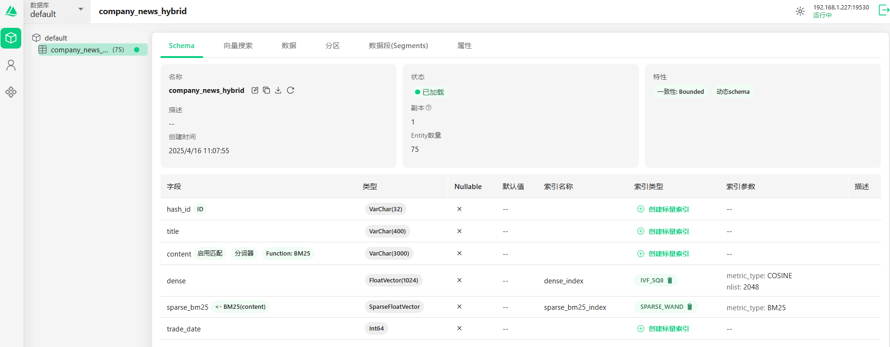
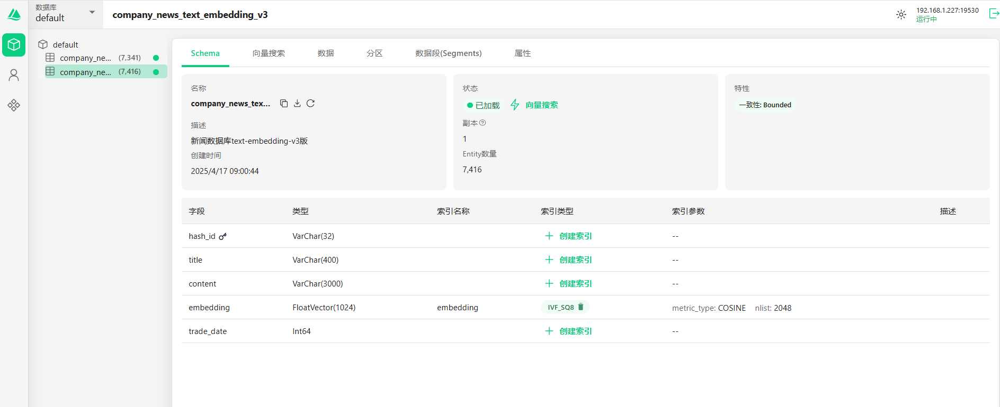

### text_embedding_to_milvus_hybrid_search_new.py
- 创建支持混合检索功能的collection(**company_news_hybrid**)，具体company_news_hybrid具体信息如下图所示。

- 来自mysql的title、content、trade_date的文本插入到milvus数据库中
- 使用向量模型：text-embedding-v3
- 注意：milvus版本需要2.5及以上
- pymilvus 的 Python SDK 版本为 2.5 及之后版本
### text_embedding_to_milvus_text-embedding-v3.py

- 来自mysql的title、content、trade_date的文本插入到milvus数据库中
- 使用向量模型：text-embedding-v3，没有混合检索功能
### text_embedding_to_milvus_hybrid_search_old.py
- 老的版本，有时会出现插入数据过程中，milvus数据库服务会中断
### evaluate_rag.py
- 不带有**混合检索**和**重排模型**的检索召回率的评估
- 向量模型：text-embedding-v1
### evaluate_rag_hybrid.py
- 带有**混合检索**的检索召回率的评估
- 向量模型：text-embedding-v3
### evaluate_rag_rerank.py
- 带有**重排模型**的检索召回率的评估
- 向量模型：text-embedding-v3 
- 重排模型：gte-rerank-v2
### evaluate_rag_rerank_bge-reranker-large.py
- 带有**重排模型**的检索召回率的评估
- 向量模型：text-embedding-v3 
- 重排模型：bge-reranker-large(本地部署)
### generate_qa.py
- 生成rag评估数据集（基于来自某时间范围内的所有新闻，生成问答对）
### generate_qa_upgrade.py
- 生成rag评估数据集（基于来自某时间范围内的需要包含主体内容的新闻，生成问答对）
### hybrid_demo.py
- 测试混合检索工作流功能
